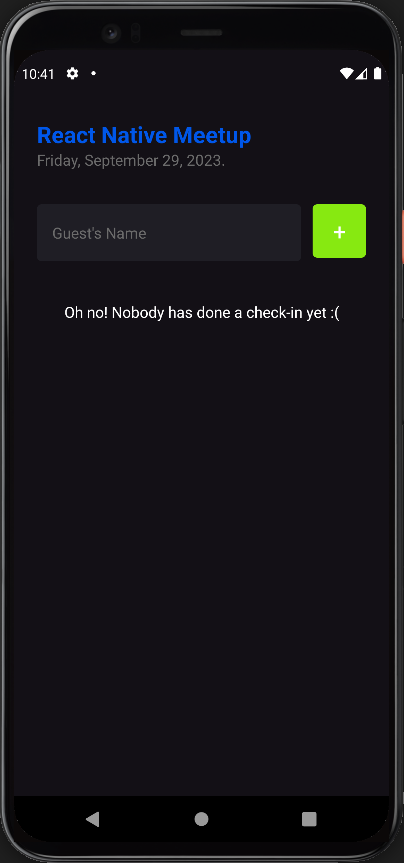
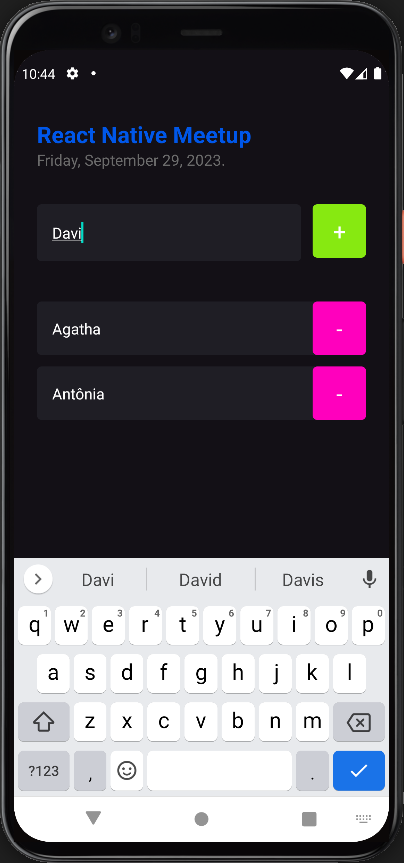
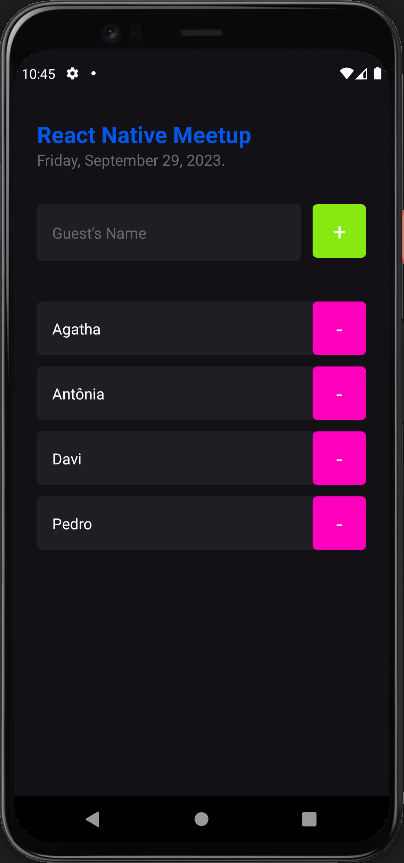
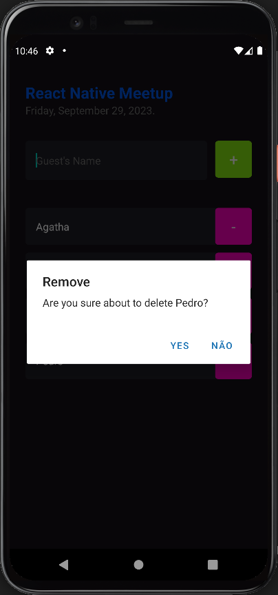

<p align="center">
  
  
  
  
</p>


<div align="center">
  <a href="#memo-project">Project</a>&nbsp;&nbsp;&nbsp;|&nbsp;&nbsp;&nbsp;
  <a href="#rocket-technologies">Technologies</a>&nbsp;&nbsp;&nbsp;|&nbsp;&nbsp;&nbsp;
  <a href="#clipboard-requirements">Requirements</a>&nbsp;&nbsp;&nbsp;|&nbsp;&nbsp;&nbsp;
  <a href="#keyboard-how-to-run-the-project">How to run the project </a>&nbsp;&nbsp;&nbsp;|&nbsp;&nbsp;&nbsp;
</div>
<br>


<br>

## :memo: Project 

This is a simple React Native application that allows event organizers to manage a guest list for an event. Organizers can add new guests, check-in attendees, and remove guests from the list.

**Features**
- Add new guests to the list.
- Prevents duplicate guest entries.
- Remove guests from the list with a confirmation prompt.
- Dynamic display of the guest list using a FlatList.
- Informative message when the guest list is empty.

This is a project developed during React Native bootcamp **[Ignite](https://github.com/Rocketseat)**, run by **[@Rocketseat](https://github.com/Rocketseat)**.
<br>

## :rocket: Technologies ##

This project was developed using the following technologies:


- [React Native](https://reactnative.dev/)
- [Expo](https://docs.expo.dev/)
- [TypeScript](https://www.typescriptlang.org/)

<br>


## :clipboard: Requirements

Before starting you need :checkered_flag:, have installed the [Git](https://git-scm.com) e [Node](https://nodejs.org/en/).
You will need to install [Expo CLI](https://docs.expo.io/versions/latest/sdk/notifications/) in you machine, you can either run the app in a simulator/emulator (iOS or Android) or scan the QR code with the Expo Go app on your physical device to see the app running live.

<br>

## :keyboard: How to run the project ##

```bash

# Clone this project
$ git@github.com:Ca-byte/im_here.git

# Access
$ cd imhere

# Install the dependencies
$ npm install

# Run the project
$ npm start

# Well done, imhere is started!


```
<br>

---

<a href="#top">☝</a>

<p style="text-align: center;">Developed with 💜 by Caroline Vieira</p>


